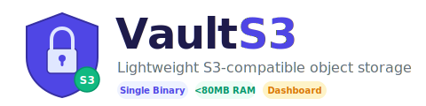
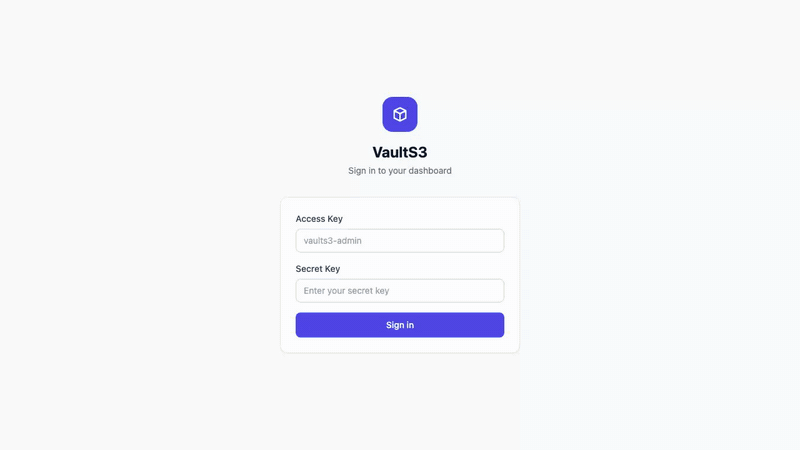
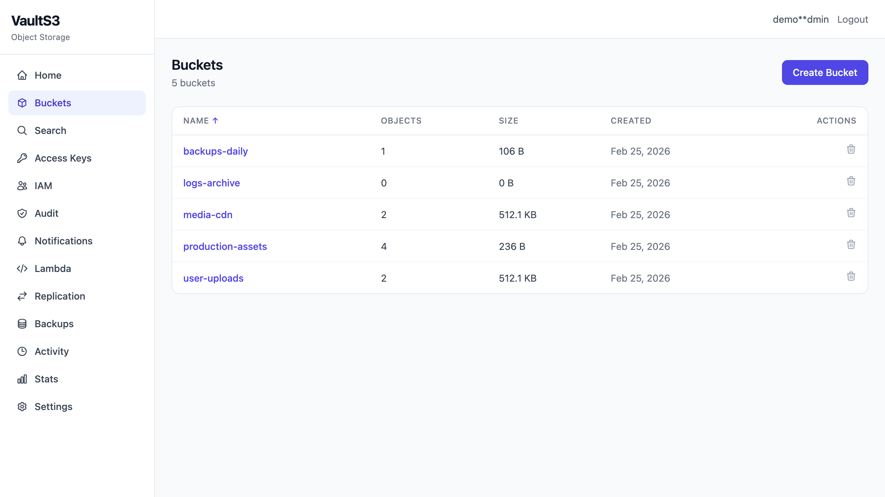
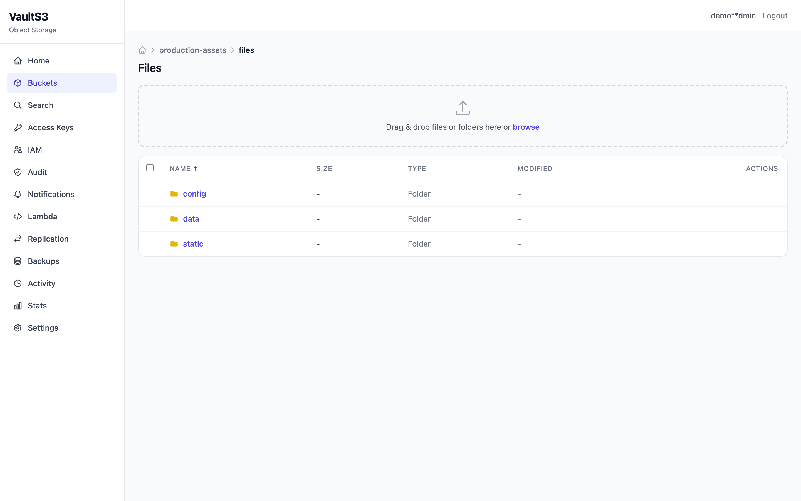
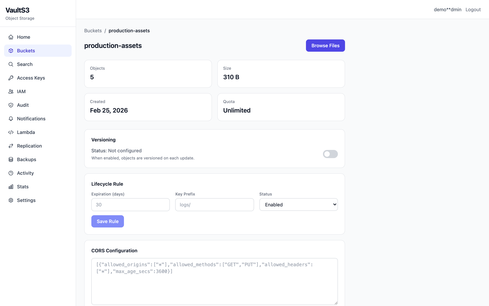
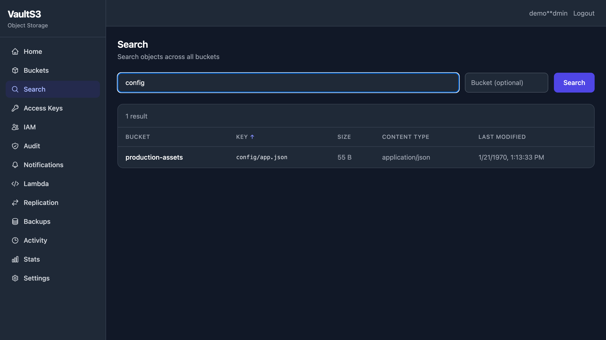
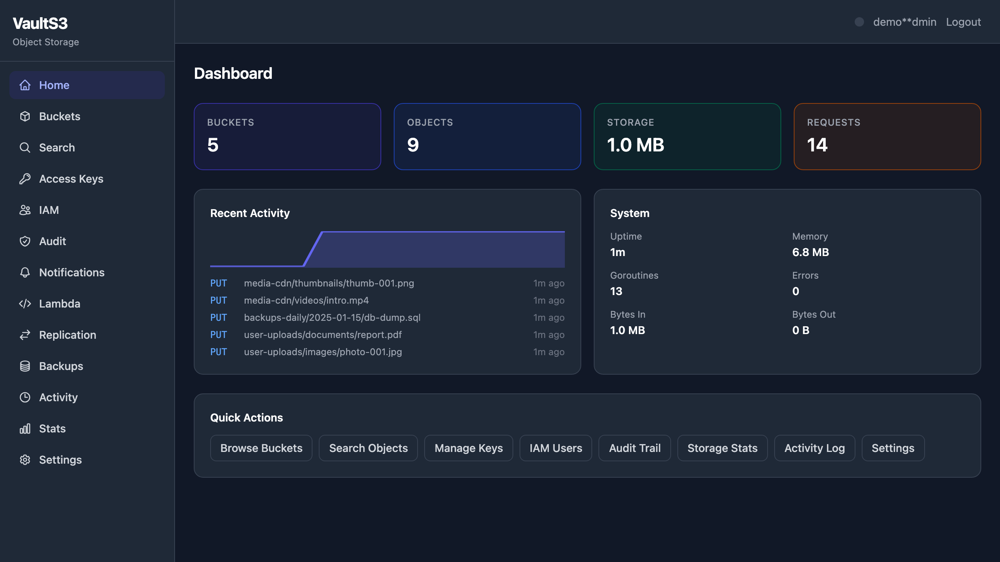
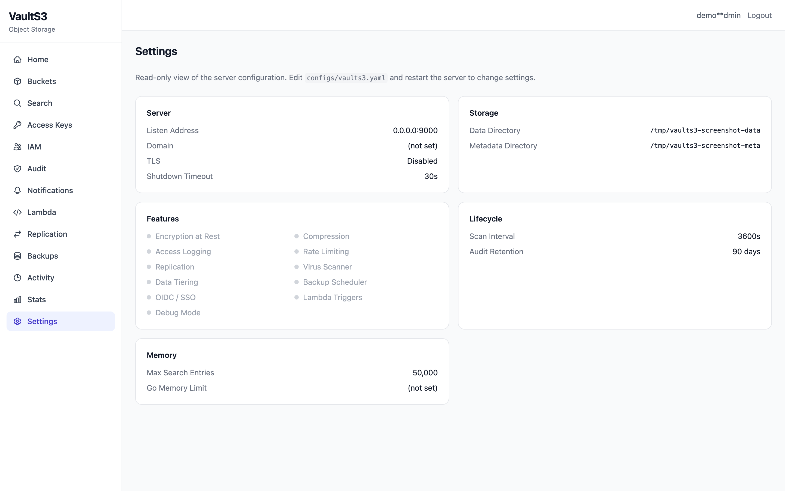

<p align="center">
  <picture>
    <source media="(prefers-color-scheme: dark)" srcset="assets/logo-dark.svg">
    <source media="(prefers-color-scheme: light)" srcset="assets/logo-with-text.svg">
    
  </picture>
</p>

<p align="center">
  <strong>Lightweight S3-compatible object storage. Single binary, &lt;80MB RAM, built-in dashboard.</strong>
</p>

<p align="center">
  <a href="https://github.com/eniz1806/VaultS3/actions"></a>
  <a href="https://hub.docker.com/r/eniz1806/vaults3"></a>
  <a href="https://github.com/eniz1806/VaultS3/blob/main/LICENSE"></a>
  <a href="https://golang.org"></a>
  <a href="https://github.com/eniz1806/VaultS3"></a>
</p>

<p align="center">
  <a href="#quick-start">Quick Start</a> &middot;
  <a href="#features">Features</a> &middot;
  <a href="#supported-s3-operations">S3 API</a> &middot;
  <a href="#web-dashboard">Dashboard</a> &middot;
  <a href="#cli-tool">CLI</a> &middot;
  <a href="#docker">Docker</a>
</p>

---

<p align="center">
  
</p>

---

## Why VaultS3?

**MinIO** needs 512MB+ RAM and locks features like per-bucket rate limiting behind a paid enterprise tier. **SeaweedFS** requires multiple components with no web UI. **Garage** lacks versioning, WORM, and notifications entirely.

**VaultS3 gives you everything in one binary under 80MB RAM:**

| | VaultS3 | MinIO | SeaweedFS | Garage |
|---|:---:|:---:|:---:|:---:|
| RAM (small deploy) | **<80 MB** | 512 MB+ | 50-200 MB | 50-150 MB |
| Single binary | **Yes** | Yes | No | Yes |
| Web dashboard | **Built-in** | Built-in | No | No |
| FUSE mount | **Built-in** | No | Buggy | No |
| Full-text search | **Yes** | No | No | No |
| Version diff/tags | **Yes** | No | No | No |
| Lambda triggers | **Yes** | No | No | No |
| Virus scanning | **Yes** | No | No | No |
| Backup scheduler | **Yes** | No | No | No |

```bash
make build && ./vaults3
# Server at http://localhost:9000
# Dashboard at http://localhost:9000/dashboard/
```

## Features

- **S3-compatible API** — Works with any S3 client (AWS CLI, mc, boto3, minio-js)
- **Single binary** — One file, no runtime dependencies, no Docker required
- **Low memory** — Targets <80MB RAM (vs MinIO's 300-500MB)
- **BoltDB metadata** — Embedded key-value store, no external database needed
- **S3 Signature V4** — Standard AWS authentication
- **AES-256-GCM encryption at rest** — Optional server-side encryption with SSE headers
- **Bucket policies** — Public-read, private, custom S3-compatible JSON policies
- **Quota management** — Per-bucket size and object count limits
- **Rate limiting** — Token bucket rate limiter per client IP and per access key to prevent abuse
- **S3 Select** — Execute SQL queries on CSV and JSON objects without downloading the full file
- **Multipart upload** — Full lifecycle (Create, UploadPart, UploadPartCopy, Complete, Abort, ListUploads, ListParts)
- **Bucket tagging** — S3-compatible tag sets with PUT/GET/DELETE
- **Bucket/Object ACL** — S3-compatible ACL responses (GET/PUT)
- **Multiple access keys** — Dynamic key management via BoltDB
- **Object tagging** — Up to 10 tags per object
- **Range requests** — Partial content downloads (206 responses)
- **Copy object** — Same-bucket and cross-bucket copies
- **Batch delete** — Multi-object delete with XML body
- **Virtual-hosted style URLs** — `bucket.domain/key` in addition to path-style
- **Bucket default retention** — Set default GOVERNANCE or COMPLIANCE retention on a bucket, auto-applied to new objects
- **Per-bucket Prometheus metrics** — Request counts, bytes in/out, and errors with bucket labels at `/metrics`
- **Prometheus metrics** — `/metrics` endpoint with storage, request, and runtime stats
- **Presigned URLs** — Pre-authenticated URL generation
- **Web dashboard** — Built-in React UI at `/dashboard/` with home overview page, file browser (sortable columns, pagination, file preview, metadata panel, version history panel with diff viewer/rollback/tagging, multi-select, bulk delete, bulk zip download, breadcrumb navigation), drag-and-drop file and folder upload, copy-to-clipboard buttons, access key management, activity log, storage stats with auto-refresh, read-only settings viewer, IAM management, audit trail viewer (sortable, paginated), search (sortable, paginated), notifications, replication status, lambda triggers, backup management, bucket config (versioning toggle with status indicator, lifecycle editor, CORS editor), keyboard shortcuts (`/` search, `?` help), toast notifications (success/error/info), dark/light theme, responsive layout
- **Health checks** — `/health` (liveness) and `/ready` (readiness) endpoints for load balancers and Kubernetes
- **Graceful shutdown** — Drains in-flight requests on SIGTERM/SIGINT with configurable timeout
- **TLS support** — Optional HTTPS with configurable cert/key paths
- **Object versioning** — Per-bucket versioning with version IDs, delete markers, version-specific GET/DELETE/HEAD
- **Object locking (WORM)** — Legal hold and retention (GOVERNANCE/COMPLIANCE) to prevent deletion
- **Lifecycle rules** — Per-bucket object expiration (auto-delete after N days) with background worker
- **Gzip compression** — Transparent compress-on-write, decompress-on-read with standard gzip
- **Access logging** — Structured JSON lines log file of all S3 operations
- **Static website hosting** — Serve index/error documents from buckets, no auth required
- **IAM users, groups & policies** — Fine-grained access control with S3-compatible policy evaluation, default deny, wildcard matching
- **CORS per bucket** — S3-compatible CORS configuration with OPTIONS preflight support
- **STS temporary credentials** — Short-lived access keys with configurable TTL, auto-cleanup of expired keys
- **Audit trail** — Persistent audit log with filtering by user, bucket, time range; auto-pruning via lifecycle worker
- **IP allowlist/blocklist** — Global and per-user CIDR-based IP restrictions with IPv4/IPv6 support
- **S3 event notifications** — Per-bucket webhook notifications on object mutations with event type and key prefix/suffix filtering, plus Kafka, NATS, and Redis backends
- **Async replication** — One-way async replication to peer VaultS3 instances with BoltDB-backed queue, retry with exponential backoff, and loop prevention
- **CLI tool** — Standalone `vaults3-cli` binary for bucket, object, user, and replication management without AWS CLI
- **Presigned upload restrictions** — Enforce max file size, content type whitelist, and key prefix on presigned PUT URLs
- **Full-text search** — In-memory search index over object metadata, tags, content type, and key patterns with incremental updates
- **Webhook virus scanning** — POST uploaded objects to a configurable scan endpoint (ClamAV, VirusTotal, etc.) with quarantine bucket for infected files
- **Data tiering** — Automatic hot/cold storage migration based on access patterns with transparent reads and manual migration API
- **Backup scheduler** — Scheduled full/incremental backups to local directory targets with cron-like scheduling and backup history
- **Git-like versioning** — Visual diff between object versions (text and binary), version tagging with labels, one-click rollback to any version
- **FUSE mount** — Mount VaultS3 buckets as local filesystem directories with read/write support, lazy loading, and SigV4 authentication. LRU block cache (256KB blocks, configurable size), metadata cache with TTL, kernel attribute caching, and SigV4 derived key caching for fast repeated reads
- **OIDC/JWT SSO** — Sign in to the dashboard with external identity providers (Google, Keycloak, Auth0) via OpenID Connect. RS256 JWT verification with JWKS auto-discovery and caching. Email domain filtering, auto-create users, OIDC group to policy mapping.
- **Lambda compute triggers** — Webhook-based function triggers on S3 events. Call external URLs with event payload and optional object body, optionally store the response as a new object. Per-bucket trigger configuration with event type and key prefix/suffix filtering. Worker pool with non-blocking dispatch.
- **SVG dashboard charts** — Pure SVG bar chart (per-bucket sizes), donut chart (request method distribution), and sparkline (request activity) on the stats page — zero dependencies
- **GitHub Actions CI** — Automated build, test, lint, and coverage on push/PR
- **pprof debug endpoint** — `/debug/pprof/*` available when `debug: true` in config for CPU/memory profiling
- **Structured logging (slog)** — All server logs use Go's `log/slog` with key-value pairs; configurable log level (`debug`, `info`, `warn`, `error`) via `logging.level` in config
- **Request ID middleware** — Every response includes an `X-Request-Id` header for request tracing
- **Panic recovery middleware** — Catches panics, logs full stack trace, returns 500 without crashing the server
- **Request latency histogram** — `vaults3_request_duration_seconds_bucket` Prometheus histogram with 11 bucket boundaries (5ms to 10s)
- **Security headers** — CSP, X-Frame-Options (DENY), X-Content-Type-Options (nosniff), HSTS (1 year), Referrer-Policy on all dashboard responses
- **CORS origin validation** — Dashboard API restricts Access-Control-Allow-Origin to same-origin and localhost (replaces wildcard `*`)
- **Dashboard API rate limiting** — Uses existing token bucket rate limiter on `/api/v1/` endpoints, returns 429 when exceeded
- **Input validation** — DNS-compatible bucket name validation (3-63 chars, lowercase, no leading/trailing hyphen) and object key validation (max 1024 chars, no null bytes)
- **RAM optimization** — Slim search index with LRU eviction cap (50K entries default), batched last-access updates (30s flush interval), configurable Go memory limit (`GOMEMLIMIT`)
- **GetObjectAttributes** — Returns object size, ETag, and storage class; used internally by AWS SDK v2
- **Bucket encryption config** — Per-bucket server-side encryption configuration (AES256, aws:kms) via `PUT/GET/DELETE /{bucket}?encryption`
- **Public access block** — Per-bucket public access block with 4 boolean flags (BlockPublicAcls, IgnorePublicAcls, BlockPublicPolicy, RestrictPublicBuckets)
- **Bucket logging config** — Per-bucket access logging configuration with target bucket and prefix
- **Docker image** — Multi-stage Dockerfile with built-in health check
- **YAML config** — Simple configuration, sensible defaults

## Supported S3 Operations

| Operation | Endpoint | Status |
|-----------|----------|--------|
| List Buckets | `GET /` | Done |
| Create Bucket | `PUT /{bucket}` | Done |
| Delete Bucket | `DELETE /{bucket}` | Done |
| Head Bucket | `HEAD /{bucket}` | Done |
| Put Object | `PUT /{bucket}/{key}` | Done |
| Get Object | `GET /{bucket}/{key}` | Done |
| Delete Object | `DELETE /{bucket}/{key}` | Done |
| Head Object | `HEAD /{bucket}/{key}` | Done |
| List Objects V2 | `GET /{bucket}?prefix=&max-keys=` | Done |
| Copy Object | `PUT /{bucket}/{key}` + `x-amz-copy-source` | Done |
| Batch Delete | `POST /{bucket}?delete` | Done |
| Multipart Upload | `POST/PUT/DELETE /{bucket}/{key}?uploads&uploadId` | Done |
| UploadPartCopy | `PUT /{bucket}/{key}?partNumber&uploadId` + `x-amz-copy-source` | Done |
| S3 Select | `POST /{bucket}/{key}?select&select-type=2` | Done |
| Object Tagging | `PUT/GET/DELETE /{bucket}/{key}?tagging` | Done |
| Bucket Policy | `PUT/GET/DELETE /{bucket}?policy` | Done |
| Bucket Quota | `PUT/GET /{bucket}?quota` | Done |
| Bucket Versioning | `PUT/GET /{bucket}?versioning` | Done |
| List Object Versions | `GET /{bucket}?versions` | Done |
| Object Locking (Legal Hold) | `PUT/GET /{bucket}/{key}?legal-hold` | Done |
| Object Locking (Retention) | `PUT/GET /{bucket}/{key}?retention` | Done |
| Bucket Default Retention | `PUT/GET /{bucket}?object-lock` | Done |
| Lifecycle Rules | `PUT/GET/DELETE /{bucket}?lifecycle` | Done |
| Website Hosting | `PUT/GET/DELETE /{bucket}?website` | Done |
| Bucket CORS | `PUT/GET/DELETE /{bucket}?cors` | Done |
| Presigned URLs | — | Done |
| Get Bucket Location | `GET /{bucket}?location` | Done |
| Bucket Tagging | `PUT/GET/DELETE /{bucket}?tagging` | Done |
| Bucket ACL | `GET/PUT /{bucket}?acl` | Done |
| Object ACL | `GET/PUT /{bucket}/{key}?acl` | Done |
| Get Object Attributes | `GET /{bucket}/{key}?attributes` | Done |
| Bucket Encryption | `PUT/GET/DELETE /{bucket}?encryption` | Done |
| Public Access Block | `PUT/GET/DELETE /{bucket}?publicAccessBlock` | Done |
| Bucket Logging | `PUT/GET /{bucket}?logging` | Done |
| List Multipart Uploads | `GET /{bucket}?uploads` | Done |
| List Parts | `GET /{bucket}/{key}?uploadId=X` | Done |
| Metrics | `GET /metrics` | Done |
| IAM (Users/Groups/Policies) | Dashboard API `/api/v1/iam/*` | Done |
| STS Temporary Credentials | `POST /api/v1/sts/session-token` | Done |
| Audit Trail | `GET /api/v1/audit` | Done |
| IP Restrictions | `PUT /api/v1/iam/users/{name}/ip-restrictions` | Done |
| Bucket Notifications | `PUT/GET/DELETE /{bucket}?notification` | Done |
| Notification Configs | `GET /api/v1/notifications` | Done |
| Replication Status | `GET /api/v1/replication/status` | Done |
| Replication Queue | `GET /api/v1/replication/queue` | Done |
| Presigned URL Generation | `POST /api/v1/presign` | Done |
| Full-Text Search | `GET /api/v1/search?q=...` | Done |
| Scanner Status | `GET /api/v1/scanner/status` | Done |
| Quarantine List | `GET /api/v1/scanner/quarantine` | Done |
| Tiering Status | `GET /api/v1/tiering/status` | Done |
| Tiering Migrate | `POST /api/v1/tiering/migrate` | Done |
| Backup List | `GET /api/v1/backups` | Done |
| Backup Trigger | `POST /api/v1/backups/trigger` | Done |
| Backup Status | `GET /api/v1/backups/status` | Done |
| Version Diff | `GET /api/v1/versions/diff` | Done |
| Version Tags | `GET/POST/DELETE /api/v1/versions/tags` | Done |
| Version Rollback | `POST /api/v1/versions/rollback` | Done |
| Rate Limit Status | `GET /api/v1/ratelimit/status` | Done |
| OIDC Config | `GET /api/v1/auth/oidc/config` | Done |
| OIDC Login | `POST /api/v1/auth/oidc` | Done |
| Lambda Triggers | `PUT/GET/DELETE /{bucket}?lambda` | Done |
| Lambda Trigger List | `GET /api/v1/lambda/triggers` | Done |
| Lambda Trigger CRUD | `GET/PUT/DELETE /api/v1/lambda/triggers/{bucket}` | Done |
| Lambda Status | `GET /api/v1/lambda/status` | Done |
| Bucket Versioning (Dashboard) | `GET/PUT /api/v1/buckets/{name}/versioning` | Done |
| Bucket Lifecycle (Dashboard) | `GET/PUT/DELETE /api/v1/buckets/{name}/lifecycle` | Done |
| Bucket CORS (Dashboard) | `GET/PUT/DELETE /api/v1/buckets/{name}/cors` | Done |
| Bulk Delete (Dashboard) | `POST /api/v1/buckets/{name}/bulk-delete` | Done |
| Bulk Download Zip | `GET /api/v1/buckets/{name}/download-zip?keys=...` | Done |
| Version List (Dashboard) | `GET /api/v1/versions?bucket=X&key=Y` | Done |
| Settings | `GET /api/v1/settings` | Done |

## Quick Start

### Build

```bash
make build
```

### Run

```bash
./vaults3
```

Server starts on `http://localhost:9000` by default.

### Configure

Edit `configs/vaults3.yaml`:

```yaml
server:
  address: "0.0.0.0"
  port: 9000
  domain: ""  # set to enable virtual-hosted URLs (e.g. "s3.example.com")
  shutdown_timeout_secs: 30
  tls:
    enabled: false
    cert_file: ""
    key_file: ""

storage:
  data_dir: "./data"
  metadata_dir: "./metadata"

auth:
  admin_access_key: "vaults3-admin"
  admin_secret_key: "vaults3-secret-change-me"

encryption:
  enabled: false
  key: ""  # 64-character hex string (32 bytes) when enabled

compression:
  enabled: false

logging:
  enabled: false
  file_path: "./access.log"
  level: "info"  # debug, info, warn, error

lifecycle:
  scan_interval_secs: 3600

security:
  ip_allowlist: []     # global CIDR allow list, empty = allow all
  ip_blocklist: []     # global CIDR deny list
  audit_retention_days: 90
  sts_max_duration_secs: 43200  # max STS token duration (12 hours)
```

### Encryption at Rest

Enable AES-256-GCM encryption by setting `encryption.enabled: true` and providing a 32-byte hex key:

```bash
# Generate a key
openssl rand -hex 32
```

When enabled, all objects are encrypted on disk with a random nonce per object. SSE headers (`x-amz-server-side-encryption: AES256`) are included in responses.

### Virtual-Hosted Style URLs

Set `server.domain` to enable virtual-hosted style access:

```yaml
server:
  domain: "s3.example.com"
```

This enables `bucket-name.s3.example.com/key` in addition to the default `s3.example.com/bucket-name/key` path-style.

### Prometheus Metrics

Access metrics at `GET /metrics`:

```bash
curl http://localhost:9000/metrics
```

Exposes: request counts by method, bytes in/out, per-bucket storage size and object counts, per-bucket request/bytes/error counters, quota usage, Go runtime stats (goroutines, memory, GC).

### Web Dashboard

The built-in dashboard is available at `http://localhost:9000/dashboard/`. Login with your admin credentials. Features:

- Bucket browser — list, create, delete buckets
- Bucket detail — view/edit policies and quotas
- File browser — list, upload (drag & drop files and folders), download, delete objects with folder navigation, multi-select with bulk delete and bulk zip download, copy-to-clipboard for S3 URIs and keys
- Access key management — create, list, revoke S3 API keys
- IAM management — users, groups, policies CRUD with attach/detach operations
- Audit trail — filter by user, bucket, time range with auto-refresh
- Search — full-text search across all buckets by key, content type, tags
- Notifications — view webhook notification configurations
- Replication — peer status cards, pending queue table
- Lambda triggers — status overview, trigger table with event filtering
- Backups — status cards, history table, manual trigger button
- Activity log — real-time S3 operation feed with auto-refresh
- Storage stats — total storage, per-bucket breakdown, runtime metrics, auto-refresh toggle (30s)
- Dark/light theme — toggle with system preference detection
- Responsive layout — mobile-friendly with collapsible sidebar
- JWT-based authentication (24h tokens)

The dashboard is embedded into the binary — no separate web server needed.

#### Screenshots

| Buckets | File Browser |
|:---:|:---:|
|  |  |

| Bucket Detail | Search |
|:---:|:---:|
|  |  |

| Dark Mode | Settings |
|:---:|:---:|
|  |  |

### Health Checks

```bash
curl http://localhost:9000/health   # liveness: {"status":"ok","uptime":"5h23m"}
curl http://localhost:9000/ready    # readiness: checks BoltDB, returns 503 if unhealthy
```

### TLS

Enable HTTPS by providing cert and key files:

```yaml
server:
  tls:
    enabled: true
    cert_file: "/path/to/cert.pem"
    key_file: "/path/to/key.pem"
```

### Docker

```bash
# From Docker Hub
docker pull eniz1806/vaults3
docker run -p 9000:9000 \
  -e VAULTS3_ACCESS_KEY=myadmin \
  -e VAULTS3_SECRET_KEY=mysupersecret \
  -v ./data:/data -v ./metadata:/metadata \
  eniz1806/vaults3

# Or build locally
docker build -t vaults3 .
docker run -p 9000:9000 -v ./data:/data -v ./metadata:/metadata vaults3
```

Images are automatically published to [Docker Hub](https://hub.docker.com/r/eniz1806/vaults3) on every push to `main`.

#### Environment Variables

All settings can be overridden via environment variables (takes precedence over config file):

| Variable | Description | Default |
|----------|-------------|---------|
| `VAULTS3_ACCESS_KEY` | Admin access key | `vaults3-admin` |
| `VAULTS3_SECRET_KEY` | Admin secret key | `vaults3-secret-change-me` |
| `VAULTS3_PORT` | Server port | `9000` |
| `VAULTS3_ADDRESS` | Bind address | `0.0.0.0` |
| `VAULTS3_DOMAIN` | Domain for virtual-hosted URLs | _(empty)_ |
| `VAULTS3_DATA_DIR` | Object storage directory | `./data` |
| `VAULTS3_METADATA_DIR` | BoltDB metadata directory | `./metadata` |
| `VAULTS3_ENCRYPTION_KEY` | 64-char hex key (enables encryption) | _(disabled)_ |
| `VAULTS3_TLS_CERT` | TLS certificate file path | _(disabled)_ |
| `VAULTS3_TLS_KEY` | TLS private key file path | _(disabled)_ |
| `VAULTS3_LOG_LEVEL` | Log level (`debug`, `info`, `warn`, `error`) | `info` |

### Object Versioning

Enable versioning on a bucket to keep multiple versions of objects:

```python
import boto3

s3 = boto3.client('s3', endpoint_url='http://localhost:9000',
    aws_access_key_id='vaults3-admin',
    aws_secret_access_key='vaults3-secret-change-me')

# Enable versioning
s3.put_bucket_versioning(Bucket='my-bucket',
    VersioningConfiguration={'Status': 'Enabled'})

# Upload creates a new version each time
s3.put_object(Bucket='my-bucket', Key='file.txt', Body=b'v1')
s3.put_object(Bucket='my-bucket', Key='file.txt', Body=b'v2')

# Get specific version
s3.get_object(Bucket='my-bucket', Key='file.txt', VersionId='...')

# Delete creates a delete marker (versions preserved)
s3.delete_object(Bucket='my-bucket', Key='file.txt')

# Permanently delete a specific version
s3.delete_object(Bucket='my-bucket', Key='file.txt', VersionId='...')
```

### Object Locking (WORM)

Protect objects from deletion with legal holds or retention policies:

```python
# Legal hold — prevents deletion regardless
s3.put_object_legal_hold(Bucket='my-bucket', Key='file.txt', VersionId='...',
    LegalHold={'Status': 'ON'})

# Retention — prevents deletion until date
s3.put_object_retention(Bucket='my-bucket', Key='file.txt', VersionId='...',
    Retention={'Mode': 'COMPLIANCE', 'RetainUntilDate': '2030-01-01T00:00:00Z'})
```

### Lifecycle Rules

Auto-delete objects after a specified number of days:

```python
s3.put_bucket_lifecycle_configuration(Bucket='my-bucket',
    LifecycleConfiguration={
        'Rules': [{
            'ID': 'expire-logs',
            'Expiration': {'Days': 30},
            'Filter': {'Prefix': 'logs/'},
            'Status': 'Enabled',
        }]
    })
```

The background worker scans objects periodically (configurable interval, default 1 hour) and deletes expired objects. Locked objects (legal hold or retention) are skipped.

### Compression

Enable gzip compression to reduce storage usage:

```yaml
compression:
  enabled: true
```

All objects are transparently compressed on write and decompressed on read. Works with encryption (data is compressed then encrypted on disk).

### Access Logging

Enable structured JSON access logs:

```yaml
logging:
  enabled: true
  file_path: "./access.log"
```

Each S3 operation is logged as a JSON line with timestamp, method, bucket, key, status code, bytes, and client IP.

### Static Website Hosting

Serve static websites directly from buckets:

```python
s3.put_bucket_website(Bucket='my-site',
    WebsiteConfiguration={
        'IndexDocument': {'Suffix': 'index.html'},
        'ErrorDocument': {'Key': 'error.html'}
    })
```

Website-enabled buckets serve `index.html` for directory paths and a custom error page for missing objects. No authentication required for GET/HEAD requests.

### IAM (Users, Groups & Policies)

Fine-grained access control with S3-compatible IAM policies:

```python
import requests, json

API = "http://localhost:9000/api/v1"
headers = {"Authorization": "Bearer <jwt-token>", "Content-Type": "application/json"}

# Create an IAM user
requests.post(f"{API}/iam/users", headers=headers, json={"name": "alice"})

# Attach a built-in policy (ReadOnlyAccess, ReadWriteAccess, FullAccess)
requests.post(f"{API}/iam/users/alice/policies", headers=headers,
    json={"policyName": "ReadOnlyAccess"})

# Create an access key for the user
resp = requests.post(f"{API}/keys", headers=headers, json={"userId": "alice"})
key = resp.json()  # {"accessKey": "...", "secretKey": "..."}

# Create groups and attach policies
requests.post(f"{API}/iam/groups", headers=headers, json={"name": "developers"})
requests.post(f"{API}/iam/groups/developers/policies", headers=headers,
    json={"policyName": "ReadWriteAccess"})

# Add user to group
requests.post(f"{API}/iam/users/alice/groups", headers=headers,
    json={"groupName": "developers"})

# Create custom policies
custom_policy = json.dumps({
    "Version": "2012-10-17",
    "Statement": [{
        "Effect": "Allow",
        "Action": ["s3:GetObject"],
        "Resource": ["arn:aws:s3:::my-bucket/*"]
    }]
})
requests.post(f"{API}/iam/policies", headers=headers,
    json={"name": "MyBucketReadOnly", "document": custom_policy})
```

Policy evaluation follows AWS IAM semantics: default deny, explicit Allow required, explicit Deny always wins. Admin keys and legacy keys (without a user) retain full access.

### CORS per Bucket

Configure Cross-Origin Resource Sharing on a per-bucket basis:

```python
s3.put_bucket_cors(Bucket='my-bucket', CORSConfiguration={
    'CORSRules': [{
        'AllowedOrigins': ['https://example.com'],
        'AllowedMethods': ['GET', 'PUT'],
        'AllowedHeaders': ['*'],
        'MaxAgeSeconds': 3600,
    }]
})
```

The server responds to `OPTIONS` preflight requests with the configured CORS headers. Unknown origins are rejected with 403.

### STS Temporary Credentials

Issue short-lived access keys for temporary access:

```python
import requests, boto3

API = "http://localhost:9000/api/v1"
headers = {"Authorization": "Bearer <jwt-token>", "Content-Type": "application/json"}

# Create temporary credentials for an IAM user (max 12 hours)
resp = requests.post(f"{API}/sts/session-token", headers=headers,
    json={"durationSecs": 3600, "userId": "alice"})
creds = resp.json()  # {"accessKey", "secretKey", "sessionToken", "expiration"}

# Use temporary credentials with any S3 client
s3 = boto3.client("s3", endpoint_url="http://localhost:9000",
    aws_access_key_id=creds["accessKey"],
    aws_secret_access_key=creds["secretKey"])
```

Temporary keys inherit the IAM user's policies. Expired keys are automatically cleaned up by the lifecycle worker.

### Audit Trail

Query the persistent audit log of all S3 operations:

```python
# List recent audit entries
requests.get(f"{API}/audit?limit=50", headers=headers)

# Filter by user, time range, or bucket
requests.get(f"{API}/audit?user=alice&limit=10", headers=headers)
requests.get(f"{API}/audit?from=1700000000&to=1700100000", headers=headers)
requests.get(f"{API}/audit?bucket=my-bucket", headers=headers)
```

Each entry records: timestamp, principal, user ID, action, resource, effect (Allow/Deny), source IP, and status code. Old entries are automatically pruned based on `security.audit_retention_days`.

### IP Restrictions

Control access by IP address at global or per-user level:

```yaml
# Global restrictions in config
security:
  ip_allowlist: ["10.0.0.0/8", "192.168.0.0/16"]  # empty = allow all
  ip_blocklist: ["10.0.0.99/32"]  # deny always wins
```

```python
# Per-user IP restrictions via API
requests.put(f"{API}/iam/users/alice/ip-restrictions", headers=headers,
    json={"allowedCidrs": ["10.0.0.0/8", "::1/128"]})

# Clear restrictions (allow from anywhere)
requests.put(f"{API}/iam/users/alice/ip-restrictions", headers=headers,
    json={"allowedCidrs": []})
```

Evaluation order: global blocklist (deny wins) → global allowlist → per-user allowlist. Admin keys are exempt from IP restrictions. Supports both IPv4 and IPv6 CIDR notation.

### S3 Event Notifications

Configure webhooks on buckets to receive notifications when objects are created or deleted:

```python
from botocore.auth import SigV4Auth
from botocore.credentials import Credentials
from botocore.awsrequest import AWSRequest
import requests

# PUT notification configuration (S3-compatible XML)
notif_xml = b"""<?xml version="1.0" encoding="UTF-8"?>
<NotificationConfiguration>
  <TopicConfiguration>
    <Id>my-webhook</Id>
    <Topic>https://example.com/webhook</Topic>
    <Event>s3:ObjectCreated:*</Event>
    <Event>s3:ObjectRemoved:*</Event>
    <Filter>
      <S3Key>
        <FilterRule>
          <Name>prefix</Name>
          <Value>images/</Value>
        </FilterRule>
      </S3Key>
    </Filter>
  </TopicConfiguration>
</NotificationConfiguration>"""

# Sign and send (using botocore for SigV4)
url = "http://localhost:9000/my-bucket?notification"
creds = Credentials("vaults3-admin", "vaults3-secret-change-me")
req = AWSRequest(method="PUT", url=url, data=notif_xml,
    headers={"Content-Type": "application/xml"})
SigV4Auth(creds, "s3", "us-east-1").add_auth(req)
requests.put(url, headers=dict(req.headers), data=notif_xml)
```

Supported events: `s3:ObjectCreated:Put`, `s3:ObjectCreated:Copy`, `s3:ObjectCreated:CompleteMultipartUpload`, `s3:ObjectRemoved:Delete`. Use wildcards like `s3:ObjectCreated:*`. Webhook payloads follow the AWS S3 event notification JSON format.

Configure webhook delivery in `configs/vaults3.yaml`:

```yaml
notifications:
  max_workers: 4       # concurrent webhook delivery goroutines
  queue_size: 256      # buffered event queue size
  timeout_secs: 10     # webhook HTTP timeout
  max_retries: 3       # retry attempts for failed webhooks
  kafka:
    enabled: true
    brokers: ["localhost:9092"]
    topic: "vaults3-events"
  nats:
    enabled: true
    url: "nats://localhost:4222"
    subject: "vaults3.events"
  redis:
    enabled: true
    addr: "localhost:6379"
    channel: "vaults3-events"   # pub/sub mode
    list_key: ""                # set for LPUSH queue mode
```

In addition to per-bucket webhooks, you can enable global notification backends. All S3 events are published to every enabled backend. Multiple backends can be active simultaneously. Disabled backends add zero overhead.

### Async Replication

Replicate objects to a peer VaultS3 instance automatically:

```yaml
replication:
  enabled: true
  peers:
    - name: "dc2"
      url: "http://peer-vaults3:9000"
      access_key: "peer-admin"
      secret_key: "peer-secret"
  scan_interval_secs: 30   # queue processing interval
  max_retries: 5           # retry before dead-letter
  batch_size: 100          # events per scan cycle
```

Objects PUT, copied, or deleted on the primary are asynchronously replicated to all configured peers via S3 API. Buckets are auto-created on peers. Failed deliveries retry with exponential backoff (5s, 15s, 45s, 135s, 405s). The `X-VaultS3-Replication` header prevents infinite loops. Monitor via dashboard API:

```bash
curl http://localhost:9000/api/v1/replication/status   # per-peer sync stats
curl http://localhost:9000/api/v1/replication/queue     # pending queue entries
```

### CLI Tool

VaultS3 includes a standalone CLI binary (`vaults3-cli`) for managing the server:

```bash
# Set credentials via environment or flags
export VAULTS3_ENDPOINT=http://localhost:9000
export VAULTS3_ACCESS_KEY=vaults3-admin
export VAULTS3_SECRET_KEY=vaults3-secret-change-me

# Bucket operations
vaults3-cli bucket list
vaults3-cli bucket create my-bucket
vaults3-cli bucket info my-bucket
vaults3-cli bucket delete my-bucket

# Object operations
vaults3-cli object put my-bucket docs/readme.md ./README.md
vaults3-cli object ls my-bucket --prefix=docs/
vaults3-cli object get my-bucket docs/readme.md ./downloaded.md
vaults3-cli object cp my-bucket/file.txt my-bucket/copy.txt
vaults3-cli object rm my-bucket docs/readme.md
vaults3-cli object presign my-bucket file.txt --expires=3600

# IAM user operations
vaults3-cli user list
vaults3-cli user create alice --access-key=ak --secret-key=sk
vaults3-cli user attach-policy alice ReadWriteAccess
vaults3-cli user delete alice

# Replication monitoring
vaults3-cli replication status
vaults3-cli replication queue
```

Build both binaries with `make build` or just the CLI with `make cli`.

### Presigned Upload Restrictions

Generate presigned PUT URLs with server-enforced restrictions:

```python
import requests

API = "http://localhost:9000/api/v1"
headers = {"Authorization": "Bearer <jwt-token>", "Content-Type": "application/json"}

# Generate restricted presigned PUT URL
resp = requests.post(f"{API}/presign", headers=headers, json={
    "bucket": "uploads",
    "key": "images/photo.jpg",
    "method": "PUT",
    "expires": 3600,
    "maxSize": 10485760,               # 10MB max
    "allowTypes": "image/jpeg,image/png",  # only images
    "requirePrefix": "images/"         # must upload to images/
})
url = resp.json()["url"]

# Upload within restrictions — succeeds
requests.put(url, data=image_data, headers={"Content-Type": "image/jpeg"})

# Upload too large / wrong type / wrong prefix — 403 Forbidden
```

Restriction parameters (`X-Vault-MaxSize`, `X-Vault-AllowTypes`, `X-Vault-RequirePrefix`) are embedded in the signed URL and validated server-side.

### Full-Text Search

Search objects by key, content type, and tags across all buckets:

```bash
# Search by key substring
curl "http://localhost:9000/api/v1/search?q=readme" -H "Authorization: Bearer <token>"

# Search by content type
curl "http://localhost:9000/api/v1/search?q=type:image" -H "Authorization: Bearer <token>"

# Search by tag
curl "http://localhost:9000/api/v1/search?q=tag:project=vaults3" -H "Authorization: Bearer <token>"

# Filter by bucket and limit results
curl "http://localhost:9000/api/v1/search?q=docs&bucket=my-bucket&limit=10" -H "Authorization: Bearer <token>"
```

The search index is built on startup from BoltDB metadata and updated incrementally on every object put, delete, copy, and tag change. Supports plain text (substring match), `type:` prefix for content-type filtering, and `tag:key=value` for tag matching.

### Webhook Virus Scanning

Scan uploaded objects with an external virus scanner (ClamAV REST, VirusTotal, etc.):

```yaml
scanner:
  enabled: true
  webhook_url: "http://localhost:3310/scan"
  timeout_secs: 30
  quarantine_bucket: "vaults3-quarantine"
  fail_closed: false          # false=fail-open (keep file), true=quarantine on error
  max_scan_size_bytes: 104857600  # 100MB
  workers: 2
```

When enabled, every uploaded object is POSTed to the webhook URL as multipart/form-data. If the scanner returns 406/403 (infected), the object is moved to the quarantine bucket and deleted from the original. Monitor via dashboard API:

```bash
curl http://localhost:9000/api/v1/scanner/status       # queue depth + recent scans
curl http://localhost:9000/api/v1/scanner/quarantine    # quarantined objects
```

### Data Tiering

Automatically migrate infrequently accessed objects to a cold storage directory:

```yaml
tiering:
  enabled: true
  cold_data_dir: "./cold_data"
  migrate_after_days: 30
  scan_interval_secs: 3600
```

Objects not accessed for `migrate_after_days` are moved to the cold data directory. On read, cold objects are transparently served and promoted back to hot storage. Manual migration is available via API:

```bash
# Check tiering status (hot/cold counts and sizes)
curl http://localhost:9000/api/v1/tiering/status -H "Authorization: Bearer <token>"

# Manually migrate an object to cold tier
curl -X POST http://localhost:9000/api/v1/tiering/migrate \
  -H "Authorization: Bearer <token>" \
  -H "Content-Type: application/json" \
  -d '{"bucket":"my-bucket","key":"archive/old-file.zip","direction":"cold"}'
```

### Backup Scheduler

Schedule automatic backups to local directories:

```yaml
backup:
  enabled: true
  targets:
    - name: "local-backup"
      type: "local"
      path: "/backups/vaults3"
  schedule_cron: "0 2 * * *"   # daily at 2am
  retention_days: 30
  incremental: false            # true for incremental backups
```

Monitor and trigger backups via API:

```bash
# Check backup status
curl http://localhost:9000/api/v1/backups/status -H "Authorization: Bearer <token>"

# List backup history
curl http://localhost:9000/api/v1/backups -H "Authorization: Bearer <token>"

# Trigger immediate backup
curl -X POST http://localhost:9000/api/v1/backups/trigger -H "Authorization: Bearer <token>"
```

Incremental backups only copy objects modified since the last successful backup. Full backups mirror the complete object store.

### Git-like Versioning

Compare, tag, and rollback object versions:

```bash
# Diff two versions (text files show line-by-line diff, binary shows metadata only)
curl "http://localhost:9000/api/v1/versions/diff?bucket=my-bucket&key=file.txt&v1=VERSION_A&v2=VERSION_B" \
  -H "Authorization: Bearer <token>"

# Tag a version with a label
curl -X POST http://localhost:9000/api/v1/versions/tags \
  -H "Authorization: Bearer <token>" \
  -H "Content-Type: application/json" \
  -d '{"bucket":"my-bucket","key":"file.txt","versionId":"VERSION_ID","tag":"v1.0"}'

# List tags for an object
curl "http://localhost:9000/api/v1/versions/tags?bucket=my-bucket&key=file.txt" \
  -H "Authorization: Bearer <token>"

# Delete a tag
curl -X DELETE "http://localhost:9000/api/v1/versions/tags?bucket=my-bucket&key=file.txt&tag=v1.0" \
  -H "Authorization: Bearer <token>"

# Rollback to a specific version (copies old version content as latest)
curl -X POST http://localhost:9000/api/v1/versions/rollback \
  -H "Authorization: Bearer <token>" \
  -H "Content-Type: application/json" \
  -d '{"bucket":"my-bucket","key":"file.txt","versionId":"VERSION_ID"}'
```

Text diffs use LCS (Longest Common Subsequence) to produce unified diffs with add/remove/equal lines. Binary files show only size and metadata differences.

### FUSE Mount

Mount a VaultS3 bucket as a local filesystem directory:

```bash
# Mount a bucket (requires macFUSE on macOS or FUSE on Linux)
vaults3-cli mount my-bucket /mnt/vaults3

# Browse files
ls /mnt/vaults3
cat /mnt/vaults3/docs/readme.txt

# Write files (creates objects in VaultS3)
echo "hello" > /mnt/vaults3/new-file.txt

# Unmount
# Press Ctrl+C in the mount terminal, or:
fusermount -u /mnt/vaults3
```

FUSE mount uses range requests for lazy loading — only the requested bytes are fetched from the server. Write support buffers data and uploads on file close.

### S3 Select (SQL on Objects)

Execute SQL queries on CSV and JSON objects without downloading the full file:

```python
from botocore.auth import SigV4Auth
from botocore.credentials import Credentials
from botocore.awsrequest import AWSRequest
import requests

# Query a CSV file
url = "http://localhost:9000/my-bucket/data.csv?select&select-type=2"
body = b"""<?xml version="1.0"?>
<SelectObjectContentRequest>
    <Expression>SELECT name, age FROM s3object WHERE city = 'New York' AND age > '25'</Expression>
    <ExpressionType>SQL</ExpressionType>
    <InputSerialization><CSV><FileHeaderInfo>USE</FileHeaderInfo></CSV></InputSerialization>
    <OutputSerialization><JSON/></OutputSerialization>
</SelectObjectContentRequest>"""

creds = Credentials("vaults3-admin", "vaults3-secret-change-me")
req = AWSRequest(method="POST", url=url, data=body, headers={"Content-Type": "application/xml"})
SigV4Auth(creds, "s3", "us-east-1").add_auth(req)
r = requests.post(url, headers=dict(req.headers), data=body)
# Returns JSON lines: {"name":"Alice","age":"30"}\n{"name":"Charlie","age":"35"}
```

Supported SQL features:
- `SELECT *` or `SELECT col1, col2` (column projection)
- `FROM s3object` (required table name)
- `WHERE col = 'value'`, `!=`, `<`, `>`, `<=`, `>=` (comparisons, numeric-aware)
- `AND` / `OR` (logical operators)
- `LIKE 'pattern%'` (SQL wildcards: `%` = any chars, `_` = single char)
- `IS NULL` / `IS NOT NULL`
- `LIMIT N`
- Column references: `name`, `s3object.name`, `s.name`, `_1` (positional for CSV without headers)

Input formats: CSV (with/without headers, custom delimiters), JSON Lines, JSON Document (array).
Output formats: JSON (one object per line) or CSV.

### Bucket Default Retention

Set default object retention on a versioned bucket — all new objects automatically inherit the retention policy:

```python
from botocore.auth import SigV4Auth
from botocore.credentials import Credentials
from botocore.awsrequest import AWSRequest
import requests

# Set default retention (requires versioning enabled)
url = "http://localhost:9000/my-bucket?object-lock"
body = b"""<?xml version="1.0" encoding="UTF-8"?>
<ObjectLockConfiguration>
  <Rule>
    <DefaultRetention>
      <Mode>GOVERNANCE</Mode>
      <Days>30</Days>
    </DefaultRetention>
  </Rule>
</ObjectLockConfiguration>"""

creds = Credentials("vaults3-admin", "vaults3-secret-change-me")
req = AWSRequest(method="PUT", url=url, data=body, headers={"Content-Type": "application/xml"})
SigV4Auth(creds, "s3", "us-east-1").add_auth(req)
requests.put(url, headers=dict(req.headers), data=body)

# All new objects now get 30-day GOVERNANCE retention automatically
s3.put_object(Bucket='my-bucket', Key='file.txt', Body=b'protected')
# file.txt cannot be deleted for 30 days
```

Modes: `GOVERNANCE` (admin can bypass with special header) or `COMPLIANCE` (nobody can shorten/remove until expiry). Requires versioning to be enabled on the bucket.

### Per-Bucket Prometheus Metrics

The `/metrics` endpoint includes per-bucket counters (limited to top 100 buckets):

```
vaults3_bucket_requests_total{bucket="my-bucket",method="PUT"} 42
vaults3_bucket_requests_total{bucket="my-bucket",method="GET"} 156
vaults3_bucket_bytes_in_total{bucket="my-bucket"} 10485760
vaults3_bucket_bytes_out_total{bucket="my-bucket"} 52428800
vaults3_bucket_errors_total{bucket="my-bucket"} 3
```

These complement the existing global metrics and per-bucket storage metrics, enabling monitoring and alerting per bucket.

### Rate Limiting

Protect against abuse and DDoS with token bucket rate limiting:

```yaml
rate_limit:
  enabled: true
  requests_per_sec: 100   # per client IP
  burst_size: 200
  per_key_rps: 50         # per access key
  per_key_burst: 100
```

When enabled, each client IP and access key gets an independent token bucket. Requests exceeding the limit receive `429 Too Many Requests` with a `Retry-After: 1` header. Stale buckets are cleaned up after 5 minutes of inactivity.

```bash
# Check rate limiter status
curl http://localhost:9000/api/v1/ratelimit/status -H "Authorization: Bearer <token>"
```

### Test with mc (MinIO Client)

```bash
mc alias set vaults3 http://localhost:9000 vaults3-admin vaults3-secret-change-me
mc mb vaults3/my-bucket
mc cp file.txt vaults3/my-bucket/
mc ls vaults3/my-bucket/
mc cat vaults3/my-bucket/file.txt
```

## Security

VaultS3 is designed with security in mind:

- **S3 Signature V4** — full signature verification including presigned URLs
- **Presigned URL validation** — signature, expiry, and restrictions enforced server-side
- **Constant-time credential comparison** — `crypto/hmac.Equal` prevents timing attacks on login
- **Path traversal protection** — `..` segments rejected at S3, API, versioning API, CopyObject/UploadPartCopy source, and filesystem layers
- **SSRF prevention** — webhook, lambda, and notification URLs blocked from targeting localhost, private IPs, and cloud metadata endpoints
- **Upload size limits** — 5GB per PUT (S3 spec), enforced with `http.MaxBytesReader`
- **Rate limiting** — per-IP token bucket using `RemoteAddr` (not spoofable via `X-Forwarded-For`)
- **AES-256-GCM encryption at rest** — optional, with SSE headers
- **IAM with default-deny** — policy evaluation engine with wildcard matching
- **Security headers** — CSP, HSTS, X-Frame-Options, X-Content-Type-Options, Referrer-Policy
- **Non-root Docker** — container runs as `vaults3` user (UID 1000)
- **Default credential warning** — startup log warns if admin credentials haven't been changed
- **Error message sanitization** — OIDC and health check errors return generic messages, preventing internal detail leaking
- **Race condition safety** — Replication handler creates per-request struct copy instead of mutating shared state
- **UploadID validation** — Hex-only regex validation prevents path traversal via crafted multipart upload IDs
- **Bounded request bodies** — All JSON API endpoints use `readJSON()` with 1MB `io.LimitReader`; bucket policy body capped at 1MB
- **OIDC SSRF prevention** — Issuer URL validated against loopback, private, and link-local addresses before JWKS discovery
- **IPv6-safe rate limiting** — Uses `net.SplitHostPort` for correct IP extraction from IPv6 `[::1]:port` addresses
- **OIDC authorization layer** — Dashboard admin routes (IAM, keys, STS, audit, settings, lambda, backups) restricted to admin user; OIDC users get read-only access
- **Encryption size cap** — 1GB max object size for encrypted reads/writes prevents OOM from 3x RAM amplification
- **Compression size cap** — 1GB max decompressed size prevents gzip bomb DoS
- **Version path traversal protection** — `versionId` parameter validated against directory escape in version storage
- **BatchDelete lock enforcement** — Batch delete respects WORM/legal-hold and validates keys against path traversal
- **SigV4 timestamp validation** — Requests with `X-Amz-Date` skewed more than 15 minutes are rejected (prevents replay)
- **Presigned URL expiry cap** — Maximum 7 days (604800 seconds), matching AWS behavior
- **Atomic file writes** — PutObject writes to temp file then renames, preventing corruption from concurrent writes
- **Backup scheduler thread safety** — Atomic bool prevents concurrent backup races
- **OIDC admin name reservation** — OIDC users cannot claim the "admin" username
- **OIDC domain validation enforcement** — Tokens without email are rejected when domain filtering is enabled
- **CORS port restriction** — Localhost CORS only allowed on the server's own port
- **Presigned URL credential isolation** — Presigned URLs use a dedicated non-admin key, preventing privilege escalation
- **CORS Host header protection** — Origin validation uses configured server address, not attacker-controlled Host header
- **Admin-only route expansion** — Backup, replication, scanner, and tiering endpoints restricted to admin users
- **Replication queue limit cap** — Queue listing capped at 1000 entries to prevent memory exhaustion
- **Backup path traversal protection** — Backup target validates resolved paths stay within base directory
- **LIKE pattern O(n*m) matching** — Iterative DP algorithm replaces recursive backtracking, preventing ReDoS
- **Tiering promotion safety** — Async cold-to-hot promotion re-checks tier state and orders operations safely
- **Lambda output key validation** — Output key template expansion validated against path traversal
- **S3 Select record cap** — JSON/CSV parsing capped at 1M records to prevent memory exhaustion
- **FUSE cache size caps** — Signature cache, HEAD cache, and LIST cache bounded to prevent unbounded memory growth
- **GetObjectAttributes version support** — Respects `versionId` parameter and handles delete markers

See [SECURITY.md](SECURITY.md) for vulnerability reporting policy and deployment best practices.

## Project Structure

```
VaultS3/
├── cmd/vaults3/main.go        — Server entry point
├── cmd/vaults3-cli/           — CLI tool (bucket, object, user, replication commands)
├── internal/
│   ├── config/                — YAML config loader
│   ├── server/                — HTTP server and routing
│   ├── s3/                    — S3 API handlers (auth, buckets, objects, multipart)
│   ├── storage/               — Storage engine interface + filesystem + encryption
│   ├── metadata/              — BoltDB metadata store
│   ├── metrics/               — Prometheus-compatible metrics collector
│   ├── iam/                   — IAM policy engine, identity, IP access control
│   ├── notify/                — Event notification dispatcher (webhook delivery)
│   ├── replication/           — Async replication worker (SigV4 signer, queue processor)
│   ├── search/                — In-memory full-text search index
│   ├── scanner/               — Webhook virus scanning with quarantine
│   ├── ratelimit/             — Token bucket rate limiter (per IP and per key)
│   ├── tiering/               — Hot/cold data tiering manager
│   ├── backup/                — Backup scheduler with local targets
│   ├── versioning/            — Version diff (LCS), tagging, rollback
│   ├── fuse/                  — FUSE filesystem mount (go-fuse/v2)
│   ├── middleware/             — HTTP middleware (request ID, panic recovery, latency, security headers)
│   ├── api/                   — Dashboard REST API (JWT auth, IAM, STS, audit)
│   └── dashboard/             — Embedded React SPA
├── web/                       — React dashboard source (Vite + Tailwind)
├── configs/vaults3.yaml       — Default configuration
├── Makefile                   — Build commands
├── Dockerfile                 — Multi-stage Docker build
└── README.md
```

## Tech Stack

- **Go** — net/http (no frameworks)
- **React 19** — Dashboard UI (embedded via `//go:embed`)
- **Tailwind CSS** — Dashboard styling
- **BoltDB** — Embedded key-value store for metadata
- **Local filesystem** — Object storage backend
- **AES-256-GCM** — Server-side encryption (optional)

## Requirements

- Go 1.21+ (build)
- Node.js 18+ (dashboard build only)
- No runtime dependencies

## Roadmap

- [x] Core S3 CRUD operations
- [x] S3 Signature V4 authentication
- [x] Presigned URLs
- [x] Content-Type detection and storage
- [x] Range requests (partial GET)
- [x] Copy object (same/cross-bucket)
- [x] Batch delete
- [x] Multipart upload (full lifecycle)
- [x] Multiple access keys
- [x] Object tagging
- [x] AES-256-GCM encryption at rest
- [x] Bucket policies (public-read, custom)
- [x] Quota management (per-bucket)
- [x] Virtual-hosted style URLs
- [x] Prometheus-compatible metrics
- [x] Web dashboard with built-in UI (login, bucket browser, file management, access keys, activity log, stats, dark/light theme, responsive)
- [x] Health check endpoints (/health, /ready)
- [x] Graceful shutdown (SIGTERM/SIGINT with configurable timeout)
- [x] TLS support (HTTPS with cert/key)
- [x] Docker image (multi-stage build with health check)
- [x] Object versioning (per-bucket, version IDs, delete markers, version-specific operations)
- [x] Object locking / WORM (legal hold, retention with GOVERNANCE/COMPLIANCE modes)
- [x] Lifecycle rules (per-bucket expiration with background worker)
- [x] Gzip compression (transparent compress/decompress)
- [x] Access logging (structured JSON lines)
- [x] Static website hosting (index/error documents, no-auth serving)
- [x] IAM users, groups & policies (fine-grained access control, policy evaluation engine, built-in policies)
- [x] CORS per bucket (S3-compatible, OPTIONS preflight)
- [x] STS temporary credentials (short-lived keys, auto-cleanup, configurable max duration)
- [x] Audit trail (persistent log, filtering by user/bucket/time, auto-pruning)
- [x] IP allowlist/blocklist (global and per-user CIDR restrictions, IPv4/IPv6)
- [x] S3 event notifications (per-bucket webhooks, event type + prefix/suffix filtering, retry with backoff)
- [x] Async replication (one-way to peer VaultS3 instances, BoltDB queue, retry with exponential backoff, loop prevention)
- [x] CLI tool (`vaults3-cli` — bucket, object, user, replication management)
- [x] Presigned upload restrictions (max size, content type whitelist, key prefix enforcement)
- [x] Full-text search (in-memory index over keys, content types, tags; `GET /api/v1/search`)
- [x] Webhook virus scanning (ClamAV/VirusTotal integration, quarantine bucket, fail-open/closed modes)
- [x] Data tiering (hot/cold storage, automatic migration based on access patterns, transparent reads, manual migration API)
- [x] Backup scheduler (full/incremental backups to local targets, cron scheduling, backup history, trigger API)
- [x] Git-like versioning (visual diff with LCS, version tagging with labels, one-click rollback)
- [x] FUSE mount (mount buckets as local filesystem, read/write, lazy loading via range requests)
- [x] Rate limiting (token bucket per IP and per access key, 429 responses, auto-cleanup)
- [x] UploadPartCopy (copy byte ranges from existing objects as multipart parts)
- [x] S3 Select (SQL queries on CSV and JSON objects, SELECT/WHERE/LIMIT/LIKE/AND/OR)
- [x] Multi-backend notifications (Kafka, NATS, Redis pub/sub and queue backends)
- [x] Bucket default retention (auto-apply GOVERNANCE/COMPLIANCE retention to new objects)
- [x] Per-bucket Prometheus metrics (request counts, bytes in/out, errors by bucket label)
- [x] OIDC/JWT SSO (dashboard login via Google/Keycloak/Auth0, RS256 JWKS verification, domain filtering, auto-create users, role mapping)
- [x] Lambda compute triggers (webhook functions on S3 events, event/key filtering, optional body inclusion, output storage, worker pool)
- [x] FUSE read cache (LRU block cache, metadata TTL cache, kernel attribute caching, SigV4 key caching)
- [x] RAM optimization (slim search index with LRU cap, batched last-access writes, GOMEMLIMIT support)
- [x] Dashboard advanced pages (IAM users/groups/policies, audit trail, search, notifications, replication, lambda triggers, backups — 7 new pages with full CRUD)
- [x] GetBucketLocation, Bucket Tagging, Bucket/Object ACL, ListMultipartUploads, ListParts (6 new S3 operations for AWS CLI/SDK compatibility)
- [x] Structured logging with slog (key-value pairs, configurable log level)
- [x] Request ID middleware (X-Request-Id header on every response)
- [x] Panic recovery middleware (stack trace logging, graceful 500 responses)
- [x] Request latency histogram (Prometheus-compatible `vaults3_request_duration_seconds_bucket`)
- [x] Go unit tests for 14 packages (metadata, storage, IAM, ratelimit, search, config, middleware, server, lifecycle, S3 handler, API, versioning, notify) — 133 tests
- [x] Makefile targets: `make test-coverage`, `make lint`
- [x] Dashboard polish: sortable table columns on all list pages (files, buckets, keys, audit, search)
- [x] Dashboard polish: client-side pagination (50 items/page) on file browser and audit trail
- [x] Dashboard polish: file preview panel (images, text files, JSON) with metadata sidebar
- [x] Dashboard polish: bucket config UI (versioning toggle, lifecycle rule editor, CORS config editor)
- [x] Dashboard API: versioning, lifecycle, and CORS endpoints for bucket settings management
- [x] SVG dashboard charts: BarChart (per-bucket sizes), DonutChart (request method distribution), Sparkline (activity)
- [x] GitHub Actions CI: build, test, lint, coverage on push/PR
- [x] pprof debug endpoint: `/debug/pprof/*` behind `debug: true` config flag
- [x] Extended stats API with request metrics (total requests, errors, bytes in/out, requests by method)
- [x] Dashboard bulk operations: multi-select with bulk delete and bulk zip download
- [x] Dashboard drag-and-drop folder upload (recursive directory reading via webkitGetAsEntry)
- [x] Dashboard auto-refresh toggle on stats page (30s interval, localStorage persistence)
- [x] Dashboard copy-to-clipboard buttons for S3 URIs, object keys, and access keys
- [x] Dashboard API: bulk-delete and download-zip endpoints
- [x] Dashboard home page with summary cards, activity sparkline, system stats, quick actions
- [x] Settings page: read-only server configuration viewer (`GET /api/v1/settings`, secrets stripped)
- [x] Keyboard shortcuts: `/` go to search, `?` shortcut help overlay, `Esc` close modal/blur
- [x] Breadcrumb navigation in file browser with home icon, chevron separators, clickable path segments
- [x] Security headers middleware (CSP, X-Frame-Options, X-Content-Type-Options, HSTS, Referrer-Policy)
- [x] CORS origin validation (same-origin + localhost, replaces wildcard)
- [x] Dashboard API rate limiting (429 Too Many Requests)
- [x] Input validation (DNS-compatible bucket names, object key constraints)
- [x] Object versioning dashboard UI (version list panel, diff viewer, rollback, version tagging, bucket versioning indicator)
- [x] Version list API (`GET /api/v1/versions?bucket=X&key=Y`)
- [x] Toast notification system (success/error/info toasts, bottom-right stack, auto-dismiss 5s)
- [x] Sortable table columns on all dashboard pages (notifications, backups, lambda triggers, replication queue)
- [x] Enhanced bucket creation wizard (optional versioning toggle + auto-expire lifecycle rule)
- [x] API tests (auth login/failure, JWT required, bucket CRUD, CORS preflight, input validation)
- [x] Versioning tests (LCS diff algorithm, text type detection, metadata diff, tag store CRUD)
- [x] Notify tests (dispatcher lifecycle, backend publish, webhook delivery, event/key filtering, retry)
- [x] Python integration test (security headers, CORS, auth, validation, bucket CRUD, versioning, settings)
